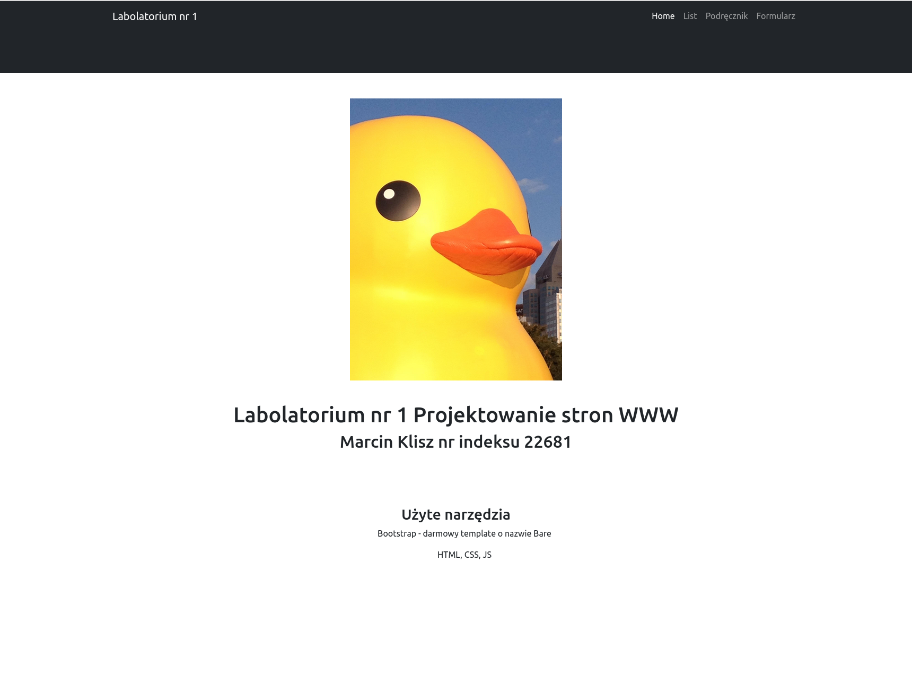
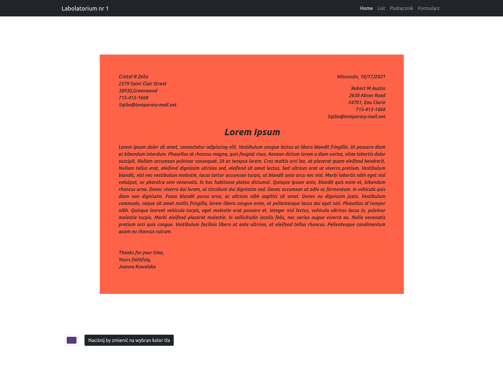

# Labolatorium nr 1

## Strona główna
Na stronie indeks umiesilem logo, informacje o sobie oraz po krótce wymienione narzedzia które użyłem do wykonania tej strony.

## Podstrona z listem
Zawiera poprawnie sformatowany list, dodatkową funkcjonalnością jest możliwość wybrania koloru z paleti barw i ustawienie go jako kolor tła.

## Podstrona z książką
Na tej podstronie użyłem lorem ipsum oraz dodalem dodatkowe elementy, charakterystyczne dla stron w podręcznikach.

## Podstrona z formularzem
Strona zawiera prosty formularz rejestracji, w kolejnym bloku można wybrać produkty. Przycisk **Podsumowanie Zamówienia** generuje zformatowaną wersję zamowienia, które przypomina proformę.

## Widok stworzonego podsumowania
